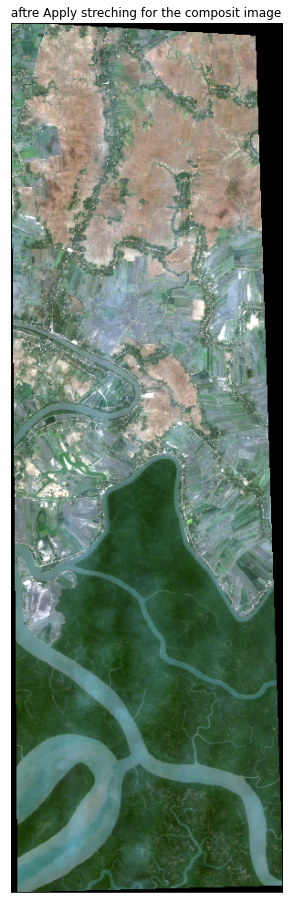

# This article introduces different methods such as data visualization and normalized vegetation, water, and geogloy indices to analyze Sundarbans satellite data using python.


```python
#Sourcce: https://towardsdatascience.com/satellite-imagery-analysis-using-python-9f389569862c

```


```python
#importing the necessary packages
from glob import glob
import earthpy as et #makes it easier to plot and work with spatial raster and vector data.. Earthpy depends upon geopandas
import earthpy.spatial as es
import earthpy.plot as ep
import rasterio as rio  #Geographic information systems use GeoTIFF and other formats to organize and store gridded raster datasets
import matplotlib.pyplot as plt
import numpy as np
from matplotlib.colors import ListedColormap
import plotly.graph_objects as go

np.seterr(divide='ignore', invalid='ignore') #Set how floating-point errors are handled.#Note that operations on integer scalar types (such as int16) are handled like floating point, and are affected by these settings.

```


    {'divide': 'ignore', 'over': 'warn', 'under': 'ignore', 'invalid': 'ignore'}


The Satellite data has 954 * 298 pixels, 12 bands with the spectral resolution varying from 10 — 60 meters... 
** read the 12 bands using rasterio and stack them into an n-dimensional array using numpy.stack() method. 
The resultant data after stacking has the shape (12, 954, 298)


```python


S_sentinel_bands = glob(r"C:\Users\Oraib\SatelliteImageryAnalysis\sundarbans_data\sundarbans_data\*B?*.TIFF")
#The glob module finds all the pathnames matching a specified pattern according to the rules
S_sentinel_bands.sort()
#print(S_sentinel_bands)
```


```python
l = []

for i in S_sentinel_bands:
  with rio.open(i, 'r') as f: #open the images on the list using the rasterio
    l.append(f.read(1)) #Read the images and append them on the list (L)
    
arr_st = np.stack(l)
```


```python
arr_st.shape
```


    (12, 954, 298)


```python
##Visualize Bands
ep.plot_bands(arr_st, 
              cmap = 'gist_earth', 
              figsize = (20, 12), 
              cols = 6, 
              cbar = False
             #,title=['fdf','gfg', ',lg','b','ng','kgdfk','fdf','gfg', ',lg','b','ng','kgdfk']
             )
plt.show()

```


    

    


```python


import matplotlib.pyplot as plt
import matplotlib.image as mpimg
plt.figure(figsize = (100,40))

img = mpimg.imread('bands.png')
imgplot = plt.imshow(img)
plt.title("Sentinel 2 Bands Meaning,\n source:https://gisgeography.com/sentinel-2-bands-combinations/", size=100)
plt.axis('off')


plt.show()

#https://gisgeography.com/sentinel-2-bands-combinations/
```


    

    


```python
rgb = ep.plot_rgb(arr_st, 
                  rgb=(3,2,1), 
                  title='composit image (The bands red, green, and blue)',
                  figsize=(10, 16))
plt.show()

# RGB Composite Image with Strech

ep.plot_rgb(arr_st,
            rgb=(3, 2, 1),
            title=" aftre Apply streching for the composit image ",
            stretch=True,
            str_clip=0.2,
            figsize=(10, 16))
plt.show()
```


    

    


    

    


The Composite images that we created can sometimes be dark if the pixel brightness values are skewed toward the value of zero. This type of problem can be solved by stretching the pixel brightness values in an image using the argument stretch=True to extend the values to the full 0-255 range of potential values to increase the visual contrast of the image. Also, the str_clip argument allows you to specify how much of the tails of the data that you want to clip off. The larger the number, the more the data will be stretched or brightened.

# Histograms
Visualizing the bands of the hyperspectral image dataset helps us to understand the distribution of pixels/values of the bands.


```python
colors = ['tomato', 'navy', 'MediumSpringGreen', 'lightblue', 'orange', 'blue',
          'maroon', 'purple', 'yellow', 'olive', 'brown', 'cyan']

ep.hist(arr_st, 
        colors = colors,
        title=[f'Band-{i}' for i in range(1, 13)], 
        cols=3, 
        alpha=0.5, 
        figsize = (12, 10))

plt.show()
```


    

    


# Vegetation Index (NDVI)


```python
ndvi = es.normalized_diff(arr_st[7], arr_st[3])

ep.plot_bands(ndvi, cmap="RdYlGn", cols=1, vmin=-1, vmax=1, figsize=(10, 14))

plt.show()
```


    

    


# Soil Adjusted Vegetation Index (SAVI)


```python
L = 0.5

savi = ((arr_st[7] - arr_st[3]) / (arr_st[7] + arr_st[3] + L)) * (1 + L)

ep.plot_bands(savi, cmap="RdYlGn", cols=1, vmin=-1, vmax=1, figsize=(10, 14))

plt.show()
```


    

    


# Visible Atmospherically Resistant Index (VARI)


```python
vari = (arr_st[2] - arr_st[3])/ (arr_st[2] + arr_st[3] - arr_st[1])

ep.plot_bands(vari, cmap="RdYlGn", cols=1, vmin=-1, vmax=1, figsize=(10, 14))

plt.show()
```


    

    


# Modified Normalized Difference Water Index (MNDWI)


```python
mndwi = es.normalized_diff(arr_st[2], arr_st[10])

ep.plot_bands(mndwi, cmap="RdYlGn", cols=1, vmin=-1, vmax=1, figsize=(10, 14))

plt.show()
```


    

    


# Moisture Index (NDMI)


```python
ndmi = es.normalized_diff(arr_st[7], arr_st[10])

ep.plot_bands(ndmi, cmap="RdYlGn", cols=1, vmin=-1, vmax=1, figsize=(10, 14))

plt.show()
```


    

    


# Clay Minerals


```python
cmr = np.divide(arr_st[10], arr_st[11])

ep.plot_bands(cmr, cmap="RdYlGn", cols=1, vmin=-1, vmax=1, figsize=(10, 14))

plt.show()
```


    

    


```python

```
